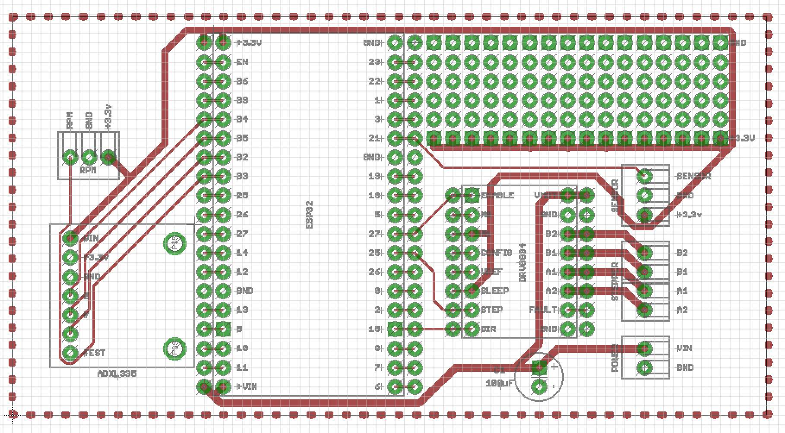
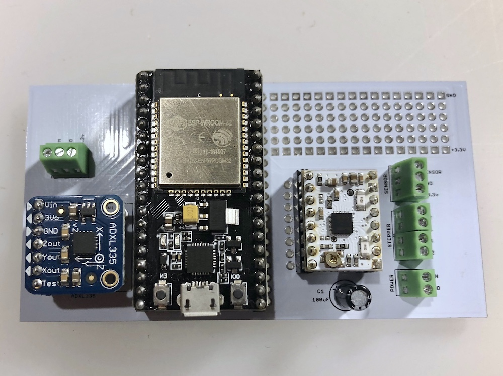
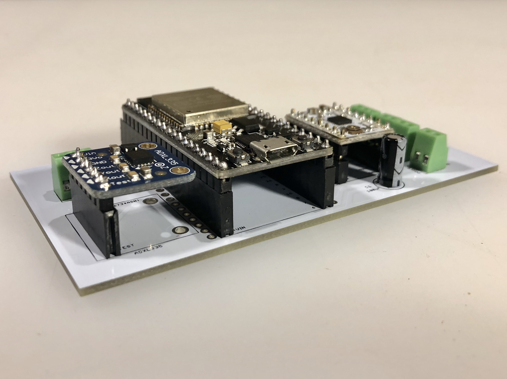
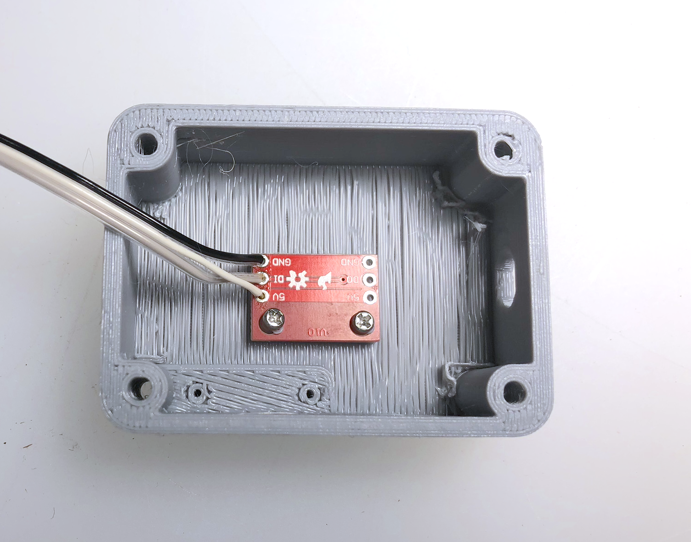
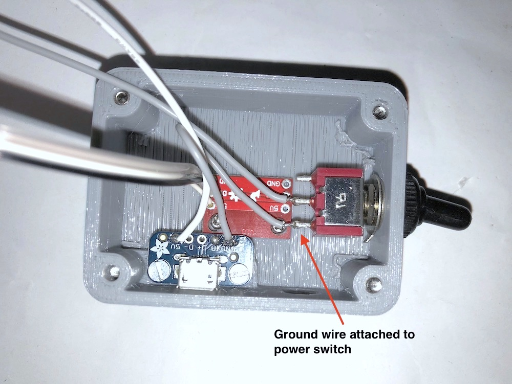
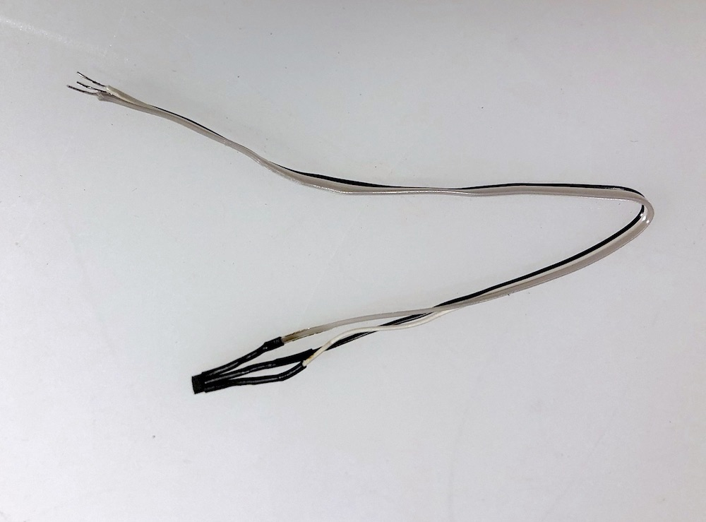
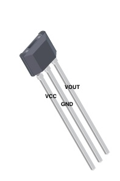
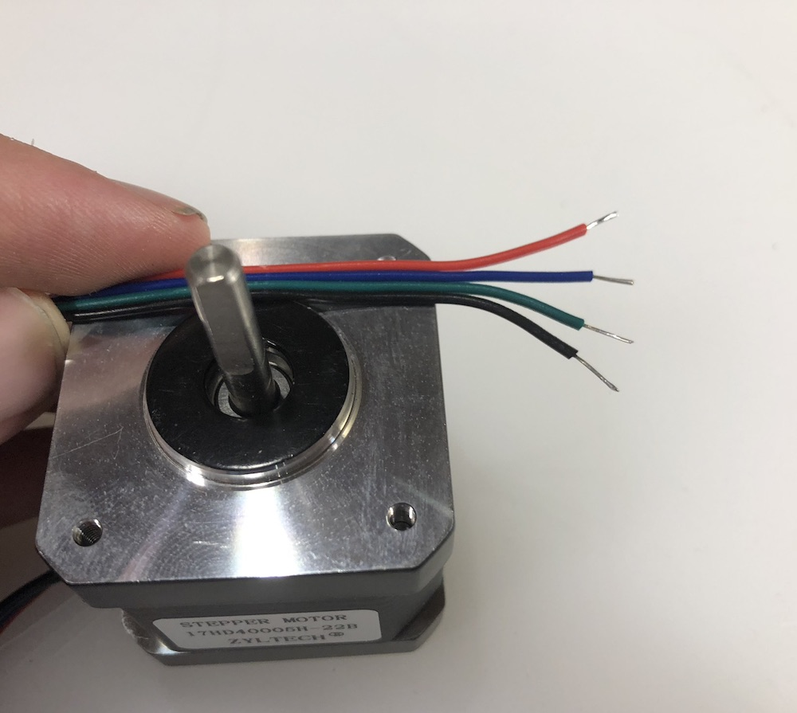

Assembling the Electronics

### PCB Layout

We designed the layout of the PCB to allow you to extend the conveyor with additional sensors or actuators. We have broken out each pin of the ESP32 and provide a solderable breadboard area at the top right of the board. This breadboard area has a ground and 3.3V rails you can use to power your sensors.

### PCB Assembly
The PCB is populated with the following components:
* ESP32 micro-controller
* DRV8834 Stepper Motor Controller
* ADXL335 Accelerometer
* 100uF Capacitor
* Screw Terminals

While the ESP32, DRV8834, and ADXL335 can all be directly soldered to the board, we suggest soldering 2.54MM female headers instead. Doing this allows you to replace the components incase of failure.

Depending on the version of the ESP32, DRV8834, and ADXL335 you purchase, you will need to first solder male 2.54MM headers on to each device before assembling it onto the conveyor.

Finished Top View:

Finished Front View (note headers):

### DRV8834 Stepper Motor Controller Setup
Before we can use the DRV8834 we will need to set the current limit on the device for the particular stepper motor you are using for the conveyor. On the product page for the DRV8834 is a current limiting section that details how to perform this operation: [DRV8834 Product Page](https://www.pololu.com/product/2134). This process involves turning the trimmer potentiometer on the DRV8834 until a the voltage reference reaches the proper value. In the case of the Zyltech NEMA 17 Stepper Motor it runs at a maximum of 1.5 amps so the voltage reference on the DRV8834 should be set no more than 0.75V (we chose 0.7V and it seems to work fine). If you use a different motor you will need to make sure this value does not exceed the max amperage of the motor. Note: You will need to have the ESP32 and the DRV8834 installed on the PCB and powered on in order to set the current limiting.   

## Power Cover Assembly

(Optional) Install the RGB LED indicator. The RGB LED gives you a visual indication of what state the conveyor belt is in. This is an optional step but highly valuable for troubleshooting operational issues with the conveyor. Before you install the RGB LED module first solder a 9in 3 wire ribbon cable on to the 5V, DI, and GND pins of the module. Tin the other ends of the ribbon cable. Attach the module using small Philips head screws as shown here:

Once the RGB LED module is installed solder a 9 in power wire to the 5V pin of the micro USB breakout module, tin the other end of the power wire. Solder a short ground wire from the GND pin of the Micro USB breakout to the on and off switch. Solder another ground wire 8-9in on the middle pin of the on/off switch, tin the other end of the ground wire. Final setup should look like this:

## Hall Effect Sensor

A Hall effect sensor is used to detect magnets in one of the conveyor pulleys to report conveyor RPM values . This sensor gets inserted into a small slot in the front piece of the the conveyor belt. To wire up the sensor you will need 9in or so of 3 wire ribbon cable. Solder each wire on to the legs of the sensor and make sure you cover the bare legs with a section of heat shrink tubing. Tin the other ends of the ribbon cable. Final assembly as shown:

Note which color wire each leg is attached to. Here's the pinout for the Hall effect sensor:

* VCC==3.3V
* GND==Ground

* VOUT==Sensor output

## Stepper Motor

If your stepper motor came with a specific connector you will need to cut it off and tin each of the wires. Here's what the stepper motor wires should look like:

