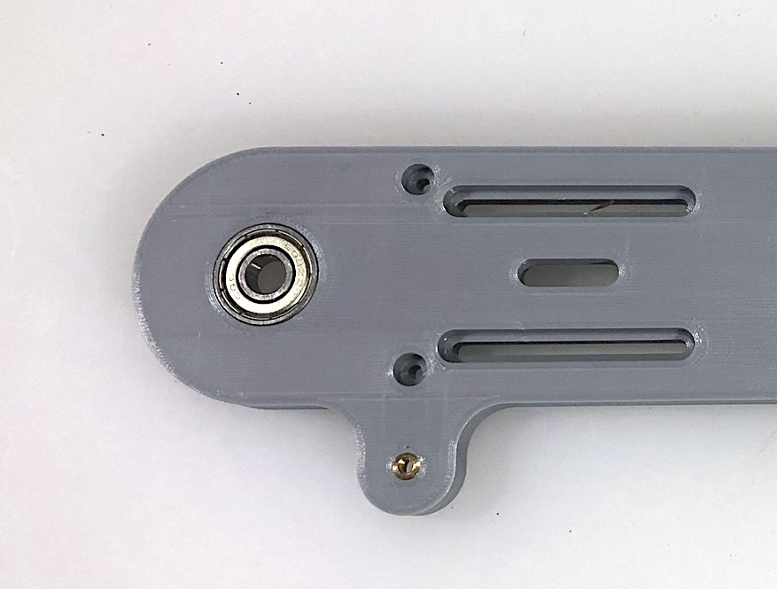
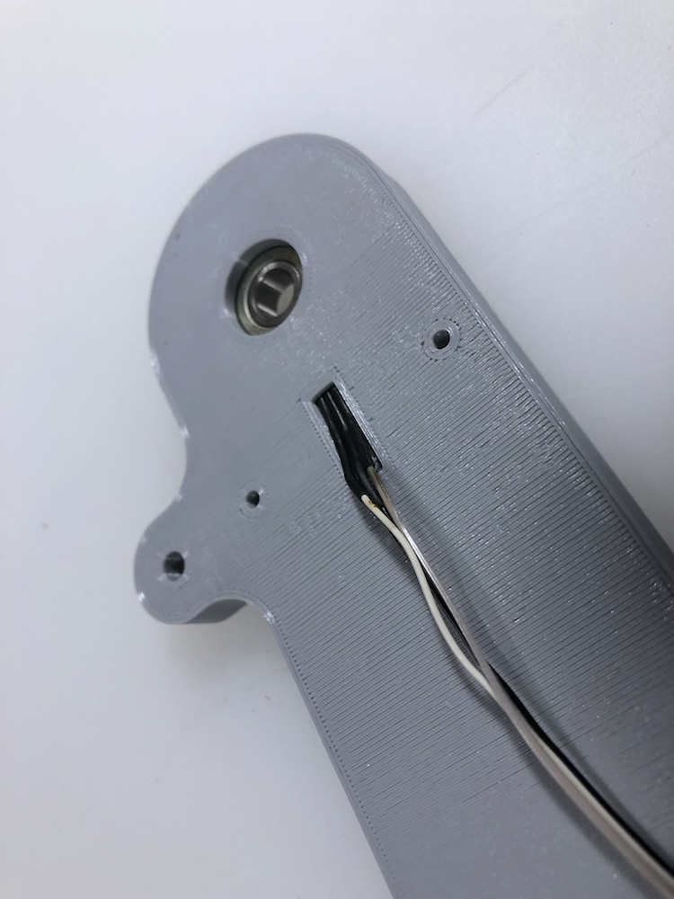
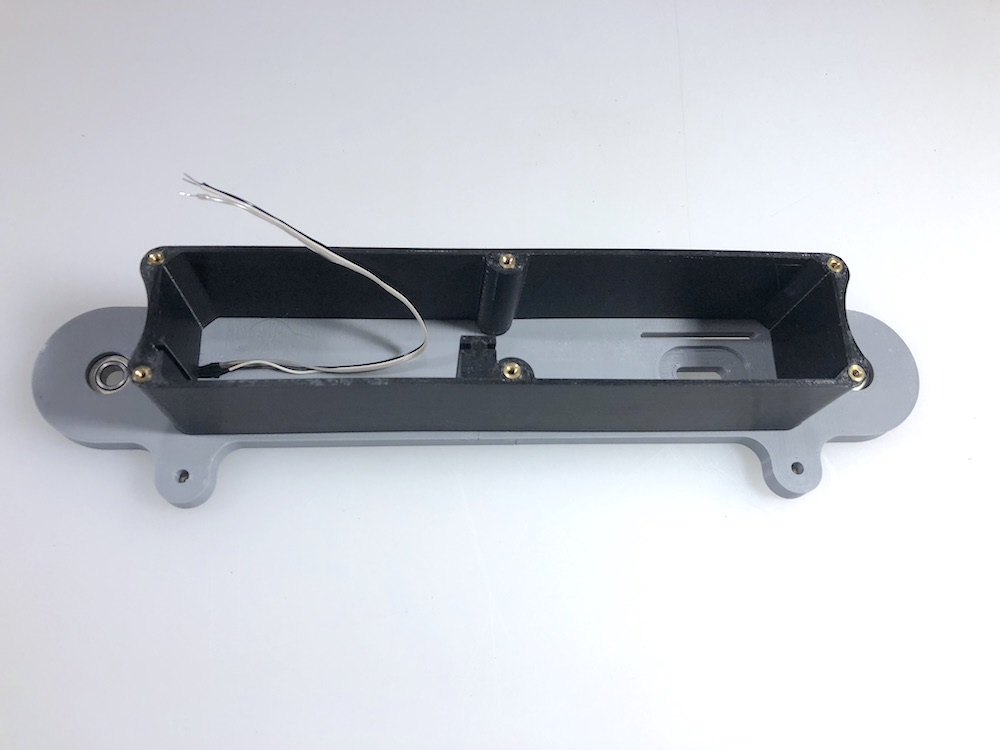
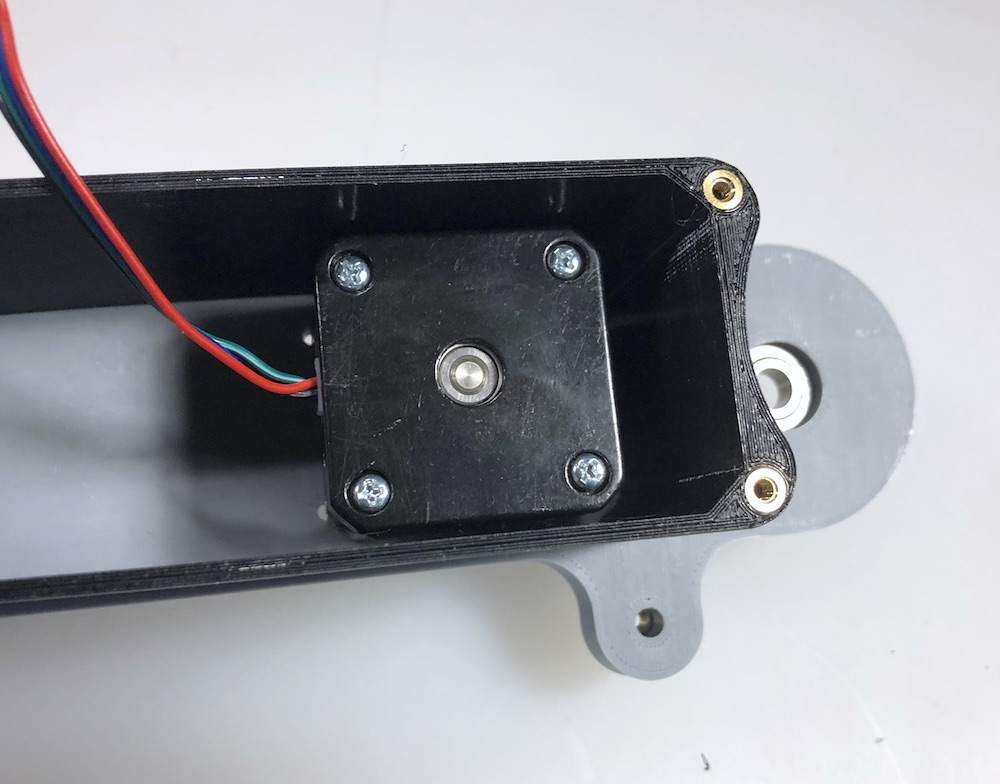
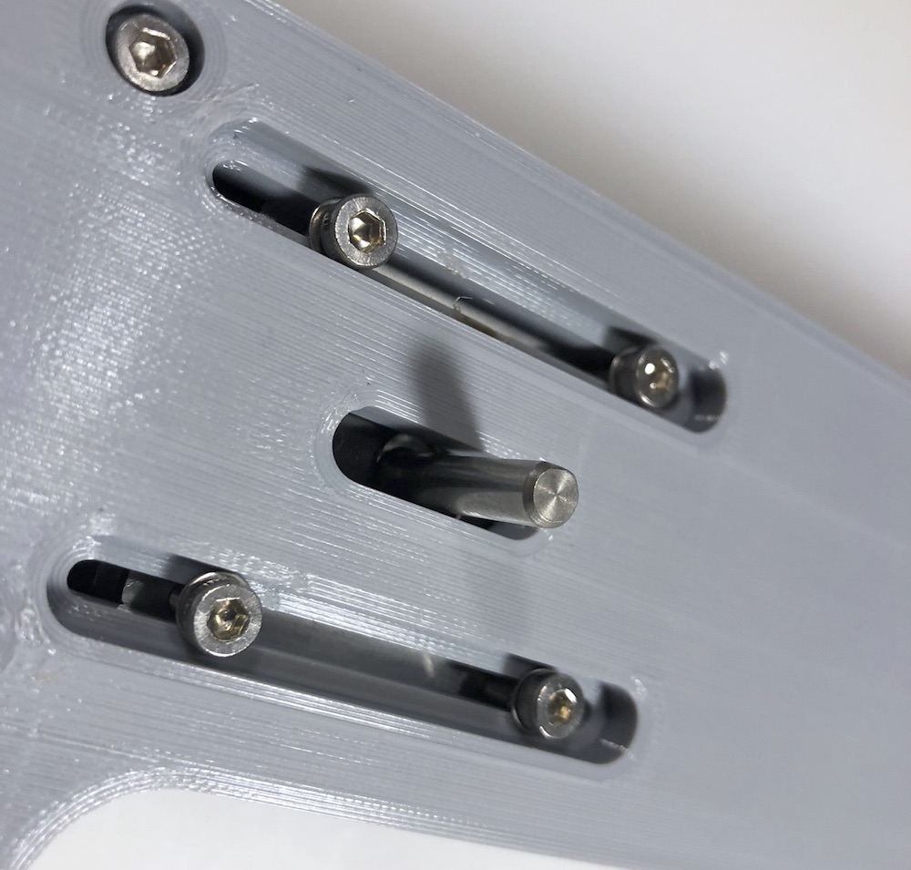
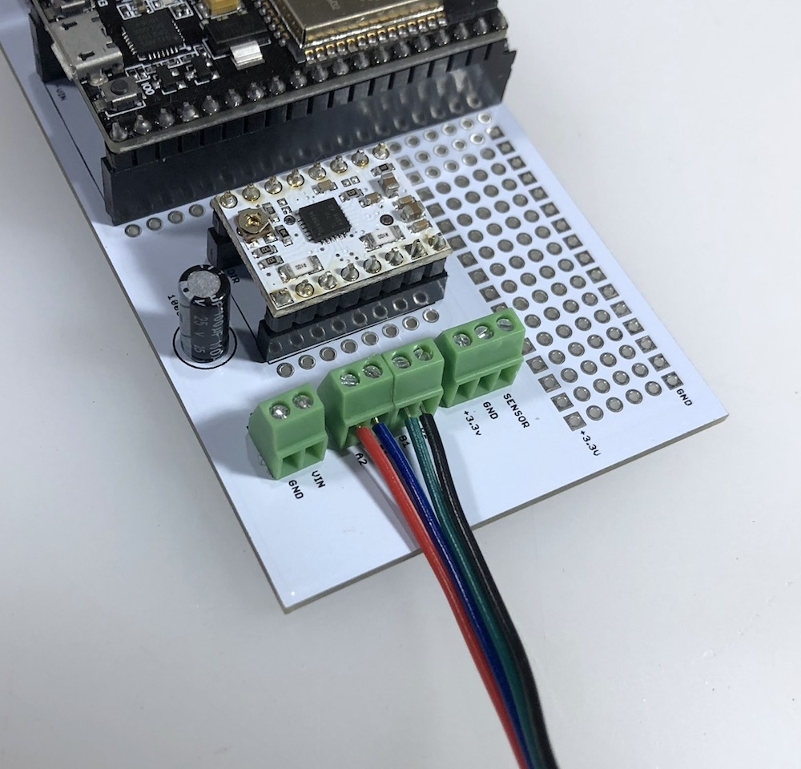
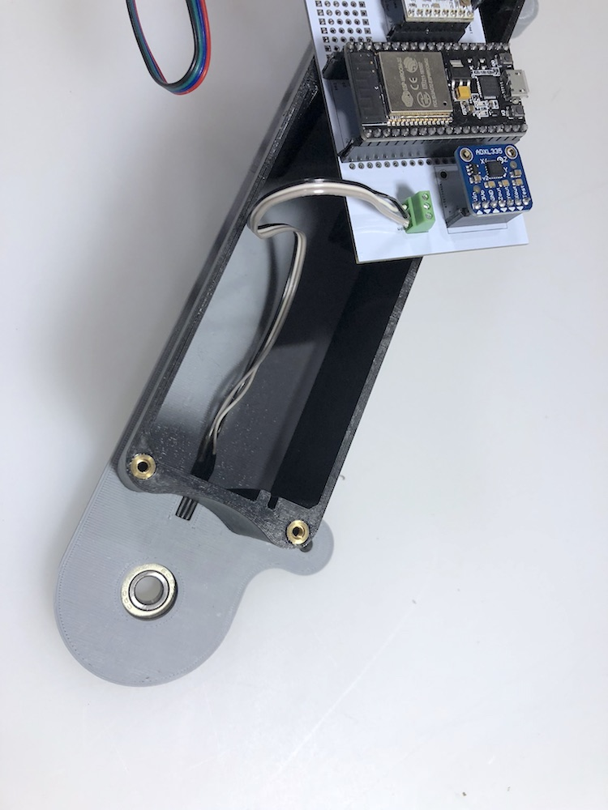
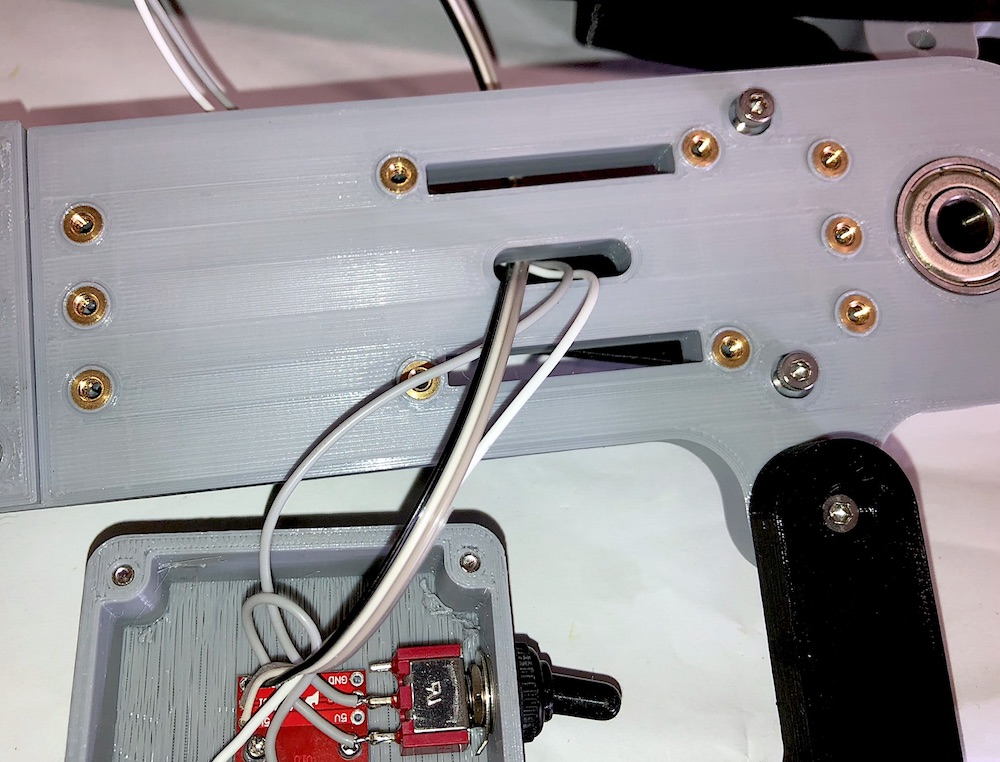

# Final Assembly
## 608 Bearing Installation
The front and back of pieces of the conveyor take four 608 bearings (two per side). Depending on how close to tolerance you were able to print the pieces you may have to ream out the the inner face of the bearing socket on the front and back with sand paper. If when the socket is close to tolerance you should be able to set the bearing most of the way by hand and then drive it flush by flipping the piece over and pressing the bearing onto a hard surface. Here's what it should look like when the bearing is seated flush in the socket:

## Hall Effect Sensor Installation

Once you have the bearings installed you can start putting the rest of the pieces together. Start by inserting the hall effect sensor assembly into the the small slot on the back side of the front piece of the belt. Make sure the front of the hall effect sensor is facing towards inside of the conveyor belt. You can tell which side of the sensor is the front because it is chamfered. Here's what it should look like when installed (note: the sensor should fit completely inside of the slot and no part of the black plastic should be exposed):

## Center Installation
Once the hall effect sensor is installed you can attach the center piece. The slots that will hold the circuit board should be positioned on the side where the hall effect sensor was installed. The 6mm M3 screws are used to attach the front piece to the center.

## Stepper Motor Installation

The front conveyor piece has a shallow cutout that allows the stepper motor to be adjusted side to side in order to tension the drive belt. To install the stepper motor press the motor into this cutout on the back side of the front piece. Note the wire direction in this example:

Once the stepper motor is pressed into the cutout flip the assembly around and affix the stepper to the front conveyor piece using 6mm M3 screws AND washers. 

## Wiring up the PCB

Now that you have the stepper motor and Hall effect sensor installed you can wire the stepper motor to the PCB. Note the color sequence for the stepper motor wires:

If you noted down the wires for the hall effect sensors wiring it to the PCB should be straight forward.

To install the power cover (on/off switch and RGB LED) you will need to thread the power and LED wires through the slot on the back conveyor piece. 

The 5V and Ground wires are then attched using the "power" screw terminals on the PCB. If you are installing the RBC LED indicator you can use the the "sensor" screw terminals. 