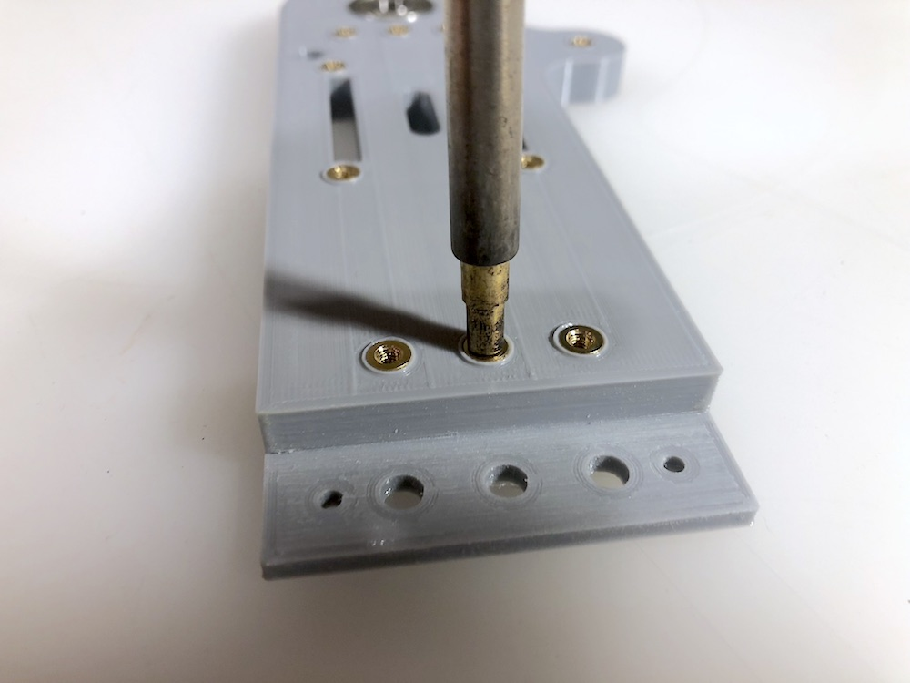
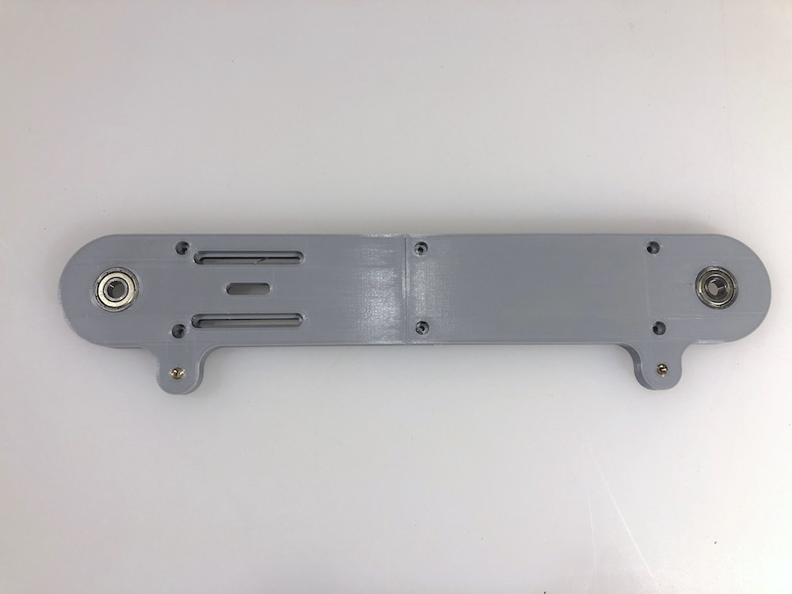
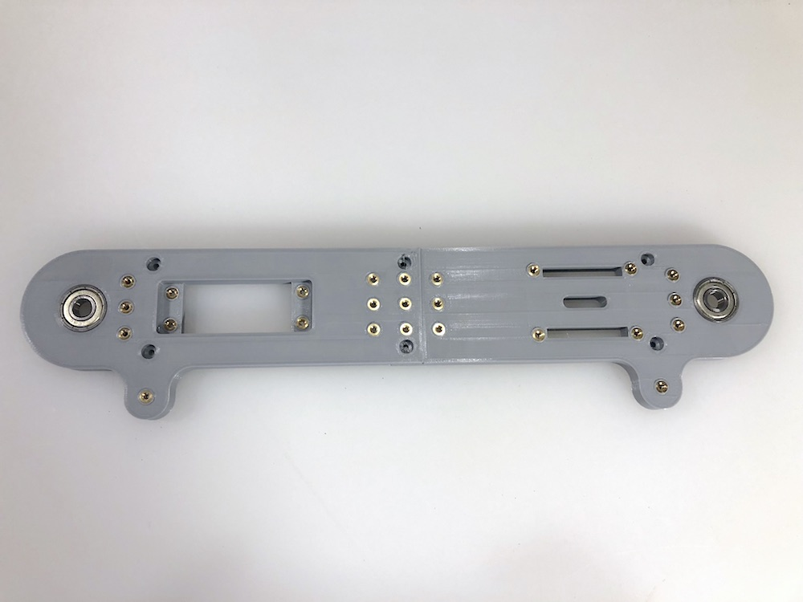
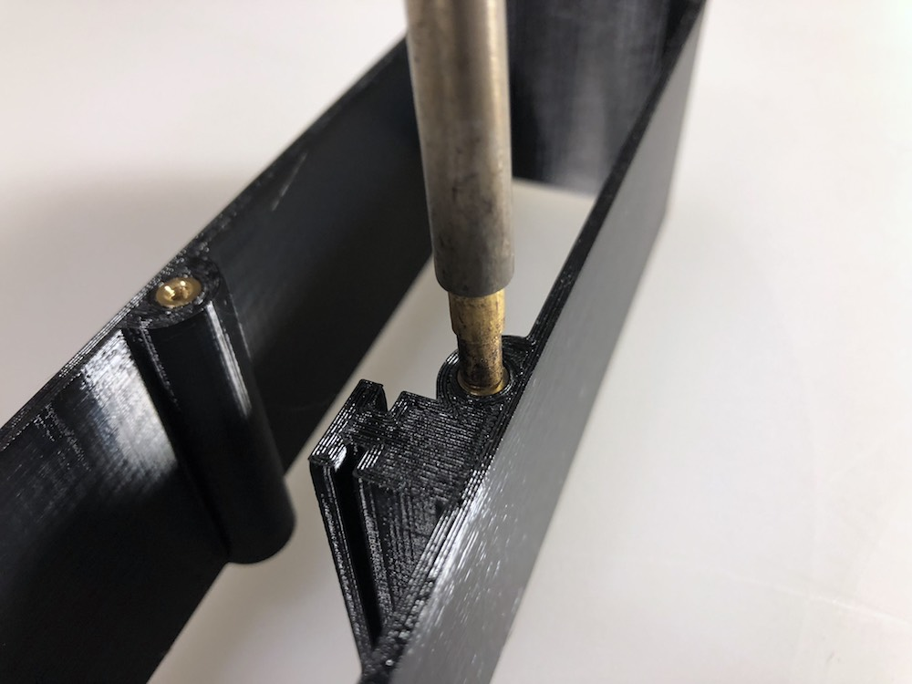

# Heat Set Inserts
Heat set inserts are brass female threaded inserts that allow you to add durable mounting points to 3D printed parts. We use these because threads in plastic parts wear out quickly. On the conveyor belt the are used in a few places. First we provide a grid of mount points on the back of the conveyor belt to attach additional sensors or actuators etc. Second we use them to assemble major parts of the conveyor belt including:
* Attaching the conveyor front and back pieces to the [center](../3d-stl-files/conveyor-center.stl) structure.
* Attaching the conveyor [legs](../3d-stl-files/conveyor-leg.stl) to the [front](../3d-stl-files/conveyor-front-one-piece.stl) and [back](../3d-stl-files/conveyor-back-one-piece.stl).
* Attaching the [Switch Cover](../3d-stl-files/conveyor-switch-cover.stl) to the back of the conveyor.
* Attaching the [back access port](../3d-stl-files/conveyor-back-access-port-cover.stl) to the back of the conveyor.
* Attaching the [100mm threaded rod](https://www.mcmaster.com/93805a375) to the belt pulleys.

Although the heat set inserts can be installed using a [specific soldering tip](http://a.co/d/4oMrtbw) made for this purpose, you should be able to still install them with a regular soldering tip.

Here's an example of an insert installation using the specialized tip:

Inserts installed on the front (total of 2 inserts):

Inserts installed on the back (total of 25 inserts):

Inserts installing on the center (total of 6 inserts per side):

There are two inserts that are used for each of the main pulley assemblies, these hold M3 threaded set screws that fix the pulley axle to the assembly. These inserts can be a bit tricky to install (note: the way we attach the pulley axel to the 3D printed part could probably use a redesign... open to suggestions here):
